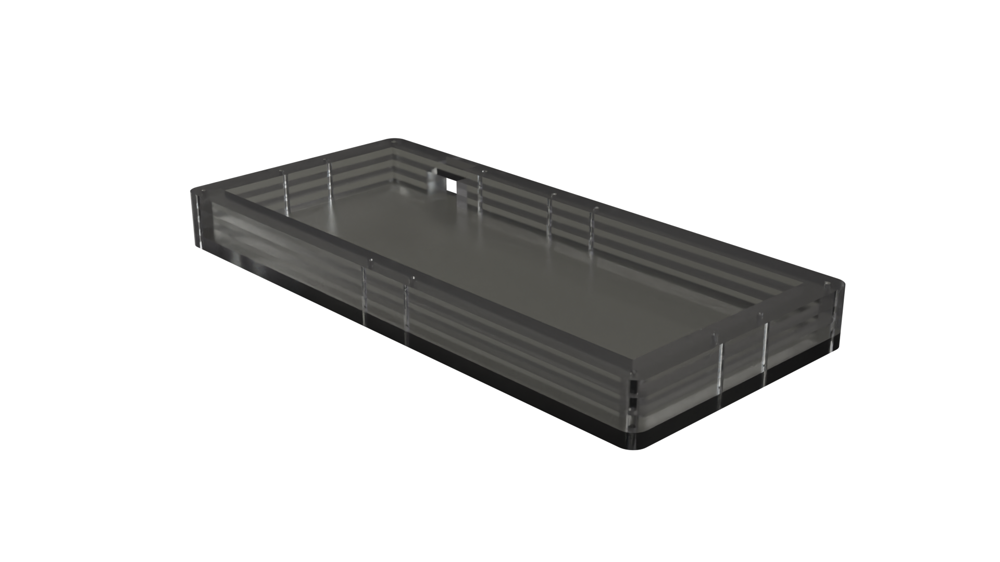
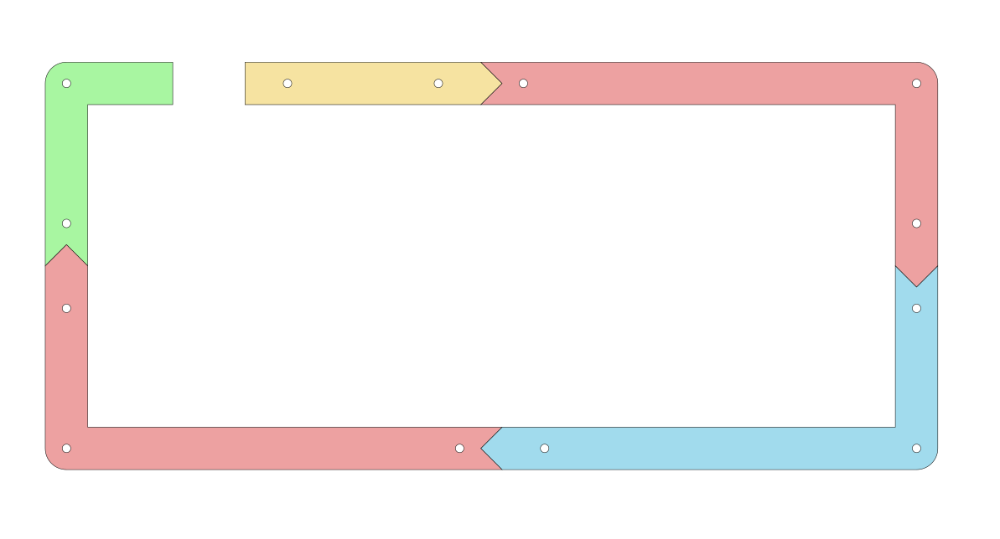

Kakoi is an open-source, "drop-in" enclosure for the Rainkeebs Yasui Ortholinear Keyboard. This project was designed to create a simple & cheap acrylic case which results in minmal waste. As this is a "drop-in" case, the actual Keyboard is held in just through gravity - meaning you can very quickly remove the keyboard from the case to swap out parts.

## Key Dimensions:
- yasui: 190x76mm
- kakoi: 210x96mm

## Versions:
- "Layered" - Each layer is a single piece of acrylic. This is the sturdiest and simplest version, but does result in more waste.
- "Split" - Each layer is made up of upto 5 pieces which interlock, allowing you to fit more pieces onto a single piece of material.

## Fabrication Info:

- Depending on the thickness of the material you intend to use, you may need to only need to cut 2-4 layers of the split middle plate. For this layer, you will need to pack the individual pieces depending on the number of layers you require - the enclosure has been designed to optimise this and reduce wasted space.
- The salmon coloured pieces in the above diagram are identical, so make sure you cut double the number of this piece as the rest.
- You only need to cut the bottom plate once.
- There is no top plate, as this is a drop-in enclosure.

## TODO:
- Update to version 2.0
- Implement low-profile bottom plate (basically no need for lower pcb plate - mount straight to acrylic plate instead).

Enjoy!
